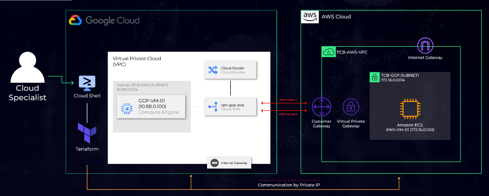

# Private communication setup between AWS and GCP

## Overview

Creating a communication channel between a VM instance in GCP and EC2 instance in AWS in a completely private way, using the Virtual Private Gateway, Customer Gateway, Cloud Routers, Cloud VPN, among other services. 

## Design

### AWS 

AWS architecture has a VPC which has two gateways

 - Internet gateway: For internet connection.
 - VPN Gateway: To connect to GCP.

The VPC consist of a subnet which has our only AWS instance. We create a route to direct traffic to VPN gateway.

We have two VPN tunnels between AWS and GCP; Hence we create two customer gateway, which then are used to create two VPN connections. 

It also includes multiple security groups to provide access for tcp, ssh etc. traffic. AWS instance is assigned these security group for respective accesses.

### GCP 

Architecture in GCP is kind of similar to that of AWS. GCP also has a VPC along with a subnet. Our only instance in GCP resides in that subnet. GCP also has two gateway, one for internet and other for VPN. It has four tunnels and a router for each tunnel. Router is allowing the traffic to AWS.  It has four firewalls to allow 4 different types of traffic.

## Implementation

- Create a GCP project with name aws-gcp and make sure billing is enabled.

- Enable compute engine API if this is first time.

- Create and download service key(json format).

- Create a policy in AWS

- AWS console | IAM | Users | Add user | Programmatic access

- Attach existing policies directly: AdministratorAccess Next | Next | Create User

- Download the .csv (credentials file)

- Upload service key from GCP and credential file from AWS to Cloud shell.

- Update terraform.tfvars to update file path for GCP and AWS credentials along with the GCP project id.

- Run `gcloud config set project [YOUR-GCP-PROJECT-ID]`

- Generate Key-Pair

- Run whoami to get user name

- Run `ssh-keygen -t rsa -f ~/.ssh/vm-ssh-key -C [YOUR-USERNAME]`

- Run `chmod 400 ~/.ssh/vm-ssh-key`

- Import the public key to GCP

- Run `gcloud compute config-ssh --ssh-key-file=~/.ssh/vm-ssh-key`

- Go to metadata page, and check if your key was imported, click on

- Click on the tab **SSH Keys**, and you'll see your ssh key!

- Importing the public key to AWS

- Proceed with the download of the 'Public Key' generated in the Cloud Shell; using File Path: /home/[YOUR-USERNAME]/.ssh/vm-ssh-key.pub

- Go to AWS console | EC2 | Network & Security | Key Pairs

- Use drop down Actions and then **Import Key Pair**

- NOTE -> You must use the name: vm-ssh-key

-  **Browse**, | Select the file **vm-ssh-key-pub** | Click on **Import key pair.**

- Go to terraform directory and run the following in sequence

-  `terraform init`

-  `terraform plan`

-  `terraform apply`

-  `terraform output`

-  `terraform destroy` => Only if you wish to destroy the setup.

- Testing using Network Intelligence | Connectivity Tests

- Create a new connectivity test

- Source endpoint will be internal IP of GCP VM instance.

- Destination endpoint will be private IP of AWS VM instance.

- View to make sure the details shows VM Instance -> Firewall -> Route -> VPN
